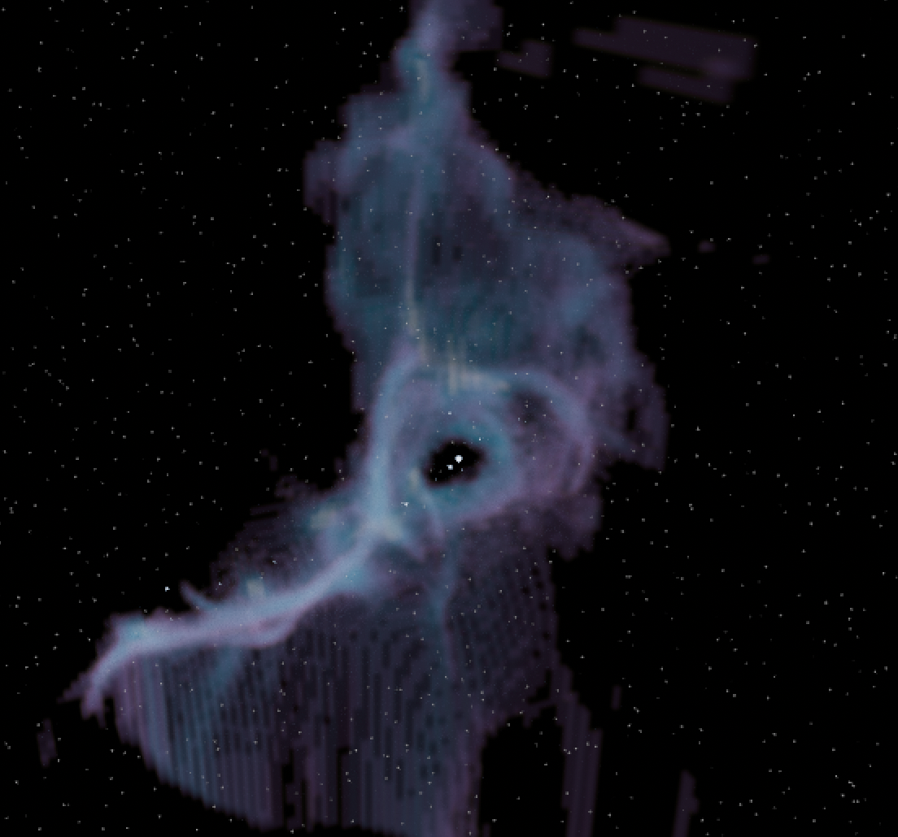

# torch-blender

Tool for converting Torch simulation data to be loaded and rendered into Blender for visualizations. 



## Installation

This package requires use of the pip package pyopenvdb. This is only available for installation on Linux systems. To install on other systems, follow the steps below. NOTE this will not work on HPCs. 

1. Install Docker desktop
2. Launch Docker desktop
3. Inside the torch-blender directory where the Dockerfile is located, build the environment with:
```
docker build -t openvdb-env .
```
4. Whenever you need to use the torch-blender package, launch Docker desktop and start the container from inside the ```torch-blender``` directory with:
```
docker run -it -v $(pwd):/workspace openvdb-env
```

## Usage

My first point of advice is to spend an hour on youtube watching general Blender tutorials, getting a hang of the GUI and keyboard shortcuts, and watching a few videos working with vdb files. 

To create a visualization with just gas, you only need a FLASH plotfile. To include stars, you need the AMUSE particle set to get stellar evolution data needed to correctly color the rendered stars. 

In the ```example/``` directory:

```example.py``` creates a vdb file from the gas and csv file from the stars for the example data found in the ```data``` directory. 

```example.blend``` is the blender file that made the image above. In the materials directory, there is a shader called ```torch-nebula``` that can be used as a starting point for your own creations. You can also just load your own VDB data into this blender file and apply the same shader directly. Also in this blender file is a simple star field background made from a Voronoi mesh.

```load_stars_blender.py``` is the script that you load into Blender using the ```Scripting``` tab. This file creates an IcoSphere object for each star in the csv, and applies BlackBody emmissivity according to the stars temperature. 
